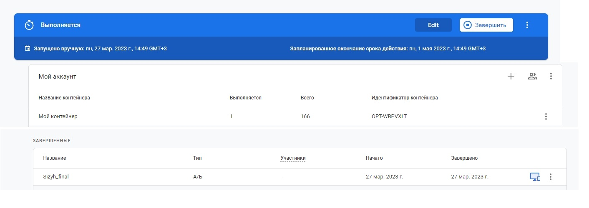

*Ваш продукт - это школа английского языка Лендинг для языковой школы. Проанализируйте
конкурентов на рынке (SkyEng, Lingvoleo и прочие) и сформулируйте гипотезу по
улучшению первого экрана лендинг. Запустите АБ тест на первый экран обновленное
предложение и обновленный призыв к действию и запустите его в Google Optimize.*  

Над дизайном лэндинга есть где поработать, сделаем несколько гипотез:
1) [Увеличить размер шрифта] для [новых посетителей] уменьшит [Bounce Rate] на [0.5%] , так как [улучшит читаемость текста для устройств без адаптивного масштабирования(зума страницы)]

2) [Добавить блок "заказ звонка" с полями для заполнения имени и телефона] для [новых посетителей] увеличит [конверсию в лиды] на [5%] , так как [откладывает принятие окончательного решения для сомневающихся пользователей, сокращает количество действия пользователя до оставления своих данных]

3) [Разнообразить цветовую гамму, сделать страницу живей за счет фотографических визуальных элементов] увеличит [конверсию] на [7%] , так как [улучшит эмоциональный посыл страницы, усилит доверие к школе]

Оценка гипотез:  
Первая гипотеза  имеет малый значимый эффект, уверенность, но легка в имплементации.  

Вторая гипотеза немного проигрывает по значимости эффекта 3-й гипотезе, но выигрывает по сложности имплементации . Уверенность хорошая, так как это стандартная практика у конкурентов.

На 3-й гипотезе понадобится вообще мультивариантный тест и несколько образцов от дизайнера.Также уверенность слабее второй, так как нужны какие-то исторические данные по нашей целевой аудитории с точки зрения психологии и предпочтения цветов. 

Выбираем для теста 2-ю гипотезу.
Вместо очередной кнопки "Попробовать" в 4-й блок добавлены поля для заполнения личных данных.

Эксперимент настроен и запущен в Google Optimize. Для просмотра отчетов нужен доступ в Google Analytics, подключенный к тэгу на сайте, и сама статистика посетителей(Google не выгружает отчеты в эксперименты меньше определенного числа пользователей).Сам эксперимент запустился и сработал удачно, варианты ловились.  

